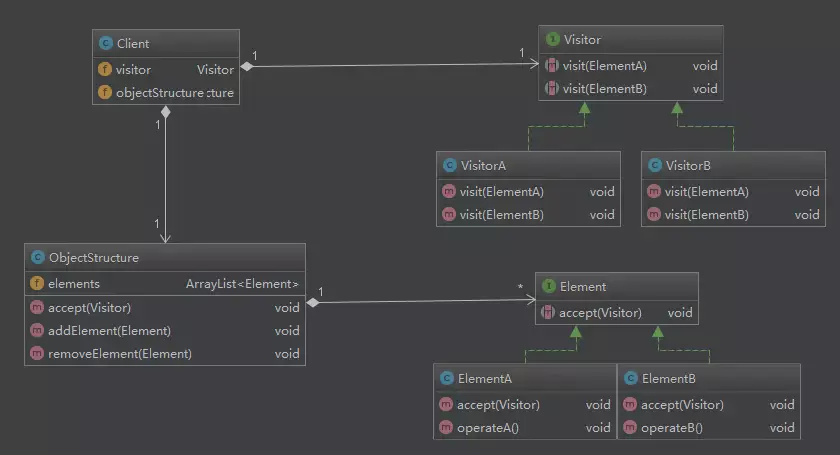

## 访问者模式

## 10.1. 模式动机

平时我们定义完一个类之后，这个类所能执行的逻辑就是确定的了，但是我们经常会遇到一种场景: 根据外部环境更改这个类所能执行的行为。

而 **访问者模式** 就是在不更改这个类的前提下，更改这个类中方法所能执行的逻辑。

## 10.2. 模式定义

表示一个作用于某对象结构中的各元素的操作。它使你可以在不改变各元素类的前提下定义作用于这些元素的新操作。

## 10.3. 模式结构

- 抽象访问者
- 访问者
- 抽象元素类
- 元素类
- 结构容器: (非必须) 保存元素列表，可以放置访问者



## 10.5. 代码分析

```
package visitor

import "fmt"

type Customer interface {
   Accept(Visitor)
}

type Visitor interface {
   Visit(Customer)
}

type EnterpriseCustomer struct {
   name string
}

type CustomerCol struct {
   customers []Customer
}

func (c *CustomerCol) Add(customer Customer) {
   c.customers = append(c.customers, customer)
}

func (c *CustomerCol) Accept(visitor Visitor) {
   for _, customer := range c.customers {
      customer.Accept(visitor)
   }
}

func NewEnterpriseCustomer(name string) *EnterpriseCustomer {
   return &EnterpriseCustomer{
      name: name,
   }
}

func (c *EnterpriseCustomer) Accept(visitor Visitor) {
   visitor.Visit(c)
}

type IndividualCustomer struct {
   name string
}

func NewIndividualCustomer(name string) *IndividualCustomer {
   return &IndividualCustomer{
      name: name,
   }
}

func (c *IndividualCustomer) Accept(visitor Visitor) {
   visitor.Visit(c)
}

type ServiceRequestVisitor struct{}

func (*ServiceRequestVisitor) Visit(customer Customer) {
   switch c := customer.(type) {
   case *EnterpriseCustomer:
      fmt.Printf("serving enterprise customer %s\n", c.name)
   case *IndividualCustomer:
      fmt.Printf("serving individual customer %s\n", c.name)
   }
}

// only for enterprise
type AnalysisVisitor struct{}

func (*AnalysisVisitor) Visit(customer Customer) {
   switch c := customer.(type) {
   case *EnterpriseCustomer:
      fmt.Printf("analysis enterprise customer %s\n", c.name)
   }
}
```

```
package visitor

func ExampleRequestVisitor() {
   c := &CustomerCol{}
   c.Add(NewEnterpriseCustomer("A company"))
   c.Add(NewEnterpriseCustomer("B company"))
   c.Add(NewIndividualCustomer("bob"))
   c.Accept(&ServiceRequestVisitor{})
   // Output:
   // serving enterprise customer A company
   // serving enterprise customer B company
   // serving individual customer bob
}

func ExampleAnalysis() {
   c := &CustomerCol{}
   c.Add(NewEnterpriseCustomer("A company"))
   c.Add(NewIndividualCustomer("bob"))
   c.Add(NewEnterpriseCustomer("B company"))
   c.Accept(&AnalysisVisitor{})
   // Output:
   // analysis enterprise customer A company
   // analysis enterprise customer B company
}
```