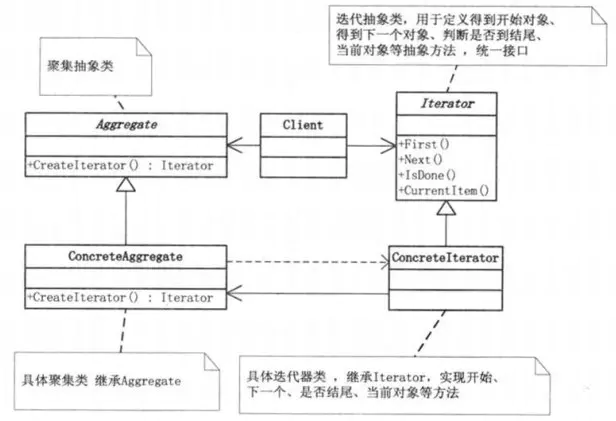

## 迭代器模式

## 6.1. 模式动机

- 完成一项任务，往往可以有多种不同的方式，每一种方式称为一个策略，我们可以根据环境或者条件的不同选择不同的策略来完成该项任务。
- 在软件开发中也常常遇到类似的情况，实现某一个功能有多个途径，此时可以使用一种设计模式来使得系统可以灵活地选择解决途径，也能够方便地增加新的解决途径。
- 在软件系统中，有许多算法可以实现某一功能，如查找、排序等，一种常用的方法是硬编码(Hard Coding)在一个类中，如需要提供多种查找算法，可以将这些算法写到一个类中，在该类中提供多个方法，每一个方法对应一个具体的查找算法；当然也可以将这些查找算法封装在一个统一的方法中，通过if…else…等条件判断语句来进行选择。这两种实现方法我们都可以称之为硬编码，如果需要增加一种新的查找算法，需要修改封装算法类的源代码；更换查找算法，也需要修改客户端调用代码。在这个算法类中封装了大量查找算法，该类代码将较复杂，维护较为困难。
- 除了提供专门的查找算法类之外，还可以在客户端程序中直接包含算法代码，这种做法更不可取，将导致客户端程序庞大而且难以维护，如果存在大量可供选择的算法时问题将变得更加严重。
- 为了解决这些问题，可以定义一些独立的类来封装不同的算法，每一个类封装一个具体的算法，在这里，每一个封装算法的类我们都可以称之为策略(Strategy)，为了保证这些策略的一致性，一般会用一个抽象的策略类来做算法的定义，而具体每种算法则对应于一个具体策略类。

## 6.2. 模式定义

简单点说，为一个容器设置一个迭代函数，可以使用这个迭代函数来顺序访问其中的每一个元素，而外部无需知道底层实现。

如果再结合 [访问者模式](https://juejin.im/post/5c00be786fb9a049c64392ad),向其中传入自定义的访问者，那么就可以让访问者访问容器中的每个元素了。

## 6.3. 模式结构

模式包含如下角色：

- 抽象聚合类: 定义一个抽象的容器

- 具体聚合类: 实现上面的抽象类，作为一个容器，用来存放元素，等待迭代

- 抽象迭代器: 迭代器接口，每个容器下都有一个该迭代器接口的具体实现

- 具体迭代器: 根据不同的容器，需要定义不同的具体迭代器，定义了游标移动的具体实现

  

## 6.5. 代码分析

```
package iterator

import "fmt"

type Aggregate interface {
   Iterator() Iterator
}

type Iterator interface {
   First()
   IsDone() bool
   Next() interface{}
}

type Numbers struct {
   start, end int
}

func NewNumbers(start, end int) *Numbers {
   return &Numbers{
      start: start,
      end:   end,
   }
}

func (n *Numbers) Iterator() Iterator {
   return &NumbersIterator{
      numbers: n,
      next:    n.start,
   }
}

type NumbersIterator struct {
   numbers *Numbers
   next    int
}

func (i *NumbersIterator) First() {
   i.next = i.numbers.start
}

func (i *NumbersIterator) IsDone() bool {
   return i.next > i.numbers.end
}

func (i *NumbersIterator) Next() interface{} {
   if !i.IsDone() {
      next := i.next
      i.next++
      return next
   }
   return nil
}

func IteratorPrint(i Iterator) {
   for i.First(); !i.IsDone(); {
      c := i.Next()
      fmt.Printf("%#v\n", c)
   }
}
```

```
package iterator

func ExampleIterator() {
   var aggregate Aggregate
   aggregate = NewNumbers(1, 10)

   IteratorPrint(aggregate.Iterator())
   // Output:
   // 1
   // 2
   // 3
   // 4
   // 5
   // 6
   // 7
   // 8
   // 9
   // 10
}
```