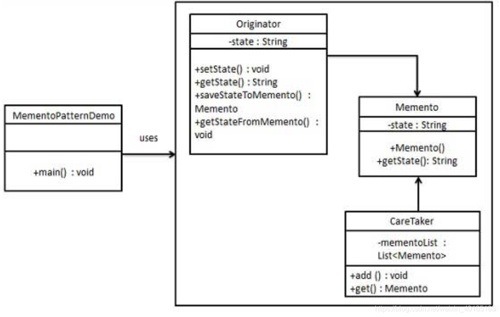

## 备忘录模式

## 8.1. 模式动机

意图：在不破坏封装性的前提下，捕获一个对象的内部状态，并在该对象之外保存这个状态。

主要解决：所以备忘录模式就是在不破坏封装的前提下，捕获一个对象的内部状态，并在该对象之外保存这个状态，这样可以在以后将对象恢复到原先保存的状态。

何时使用：很多时候我们总是需要一个对象的内部状态，这样做的目的就是为了允许用户取消不确定或者错误的操作，能够恢复到它原先的状态，使得它有后悔药可吃。

如何解决：通过一个备忘录专门存储对象状态。

关键代码：客户不与备忘录类耦合，与备忘录管理类耦合。

优点：

- 给用户提供了一种可以恢复状态的机制，可以使得用户能够比较方便地回到某个历史的状态。
- 实现了信息的封装，使得用户不需要关心状态的保存细节。

缺点：消耗资源。如果类的成员变量过多，势必会占用比较大的资源，而且每一次保存都会消耗一定的内存。

使用场景：需要保存恢复数据的相关状态场景、提供一个可回滚的操作

## 8.2. 模式定义

备忘录模式保存一个对象的某个状态，以便在适当的时候恢复对象。备忘录模式属于行为模式。

## 8.3. 模式结构

备忘录模式使用三个类 *Memento*、*Originator* 和 *CareTaker*。Memento 包含了要被恢复的对象的状态。Originator 创建并在 Memento 对象中存储状态。Caretaker 对象负责从 Memento 中恢复对象的状态。

*MementoPatternDemo*，我们的演示类使用 *CareTaker* 和 *Originator* 对象来显示对象的状态恢复。



## 8.5. 代码分析

```
package memento

import "fmt"

type Memento interface{}

type Game struct {
   hp, mp int
}

type gameMemento struct {
   hp, mp int
}

func (g *Game) Play(mpDelta, hpDelta int) {
   g.mp += mpDelta
   g.hp += hpDelta
}

func (g *Game) Save() Memento {
   return &gameMemento{
      hp: g.hp,
      mp: g.mp,
   }
}

func (g *Game) Load(m Memento) {
   gm := m.(*gameMemento)
   g.mp = gm.mp
   g.hp = gm.hp
}

func (g *Game) Status() {
   fmt.Printf("Current HP:%d, MP:%d\n", g.hp, g.mp)
}
```

```
package memento

func ExampleGame() {
   game := &Game{
      hp: 10,
      mp: 10,
   }

   game.Status()
   progress := game.Save()

   game.Play(-2, -3)
   game.Status()

   game.Load(progress)
   game.Status()

   // Output:
   // Current HP:10, MP:10
   // Current HP:7, MP:8
   // Current HP:10, MP:10
}
```