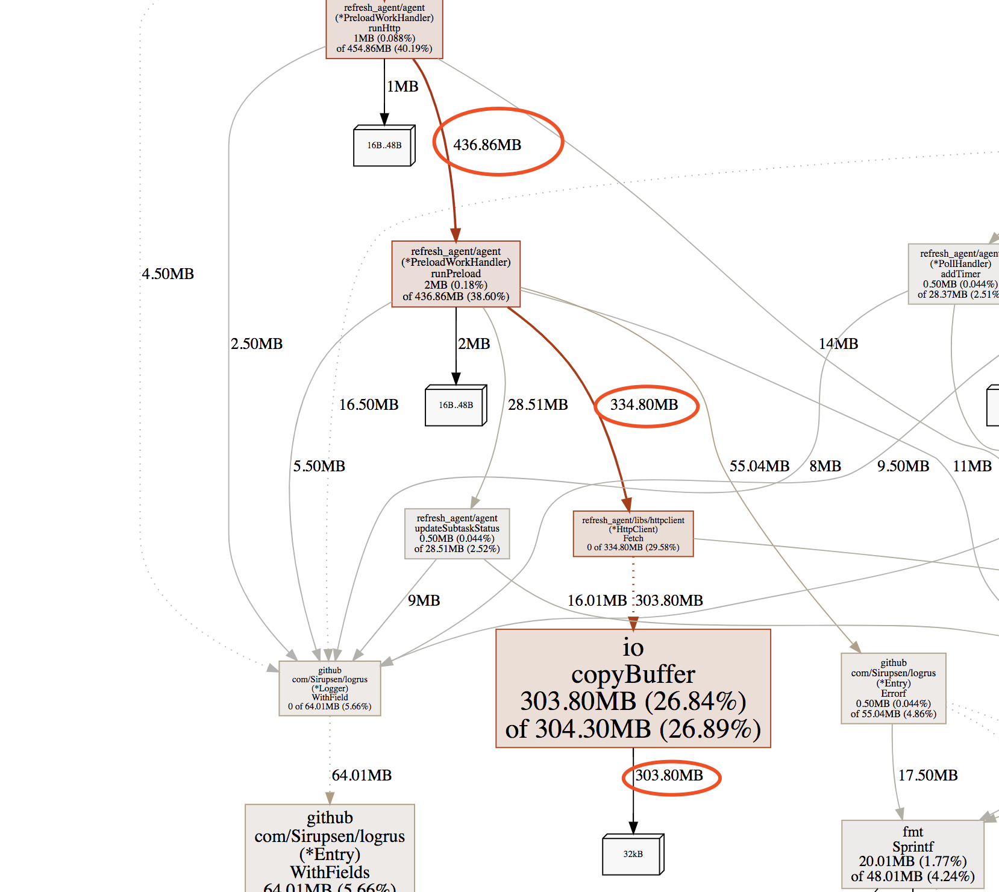
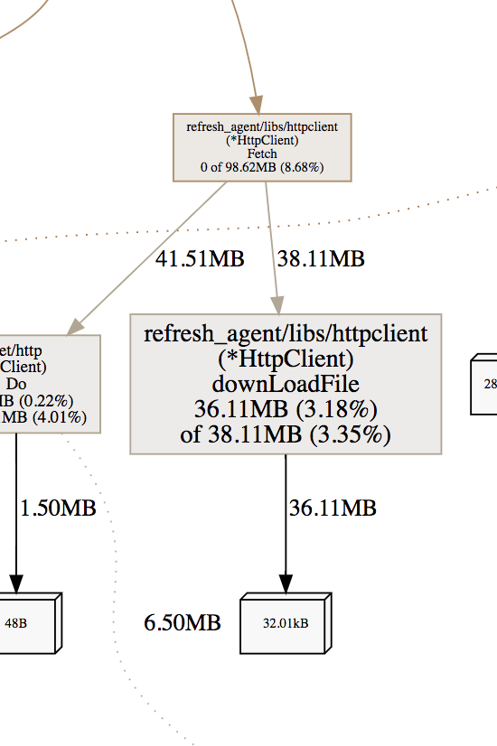

# golang gc 优化思路以及实例分析

 一个即将上线的go 写的高频服务，压测的时候发现 gc 特别高，高到10%-15% 左右了，本文记录下优化 gc 的过程和和思路。线上环境1.10.

  该文章后续仍在不断的更新修改中， 请移步到原文地址[http://dmwan.cc](http://dmwan.cc/)

  首先，查看gc 是否有异常，我们可以使用 gctrace 跟踪实时的gc 。执行下面命令可以看到gc 的实时信息。

```bash
GODEBUG=gctrace=1 go run cmd/agent_bin.go
```

  输出结果如下:

```bash
gc 45 @37.801s 11%: 0.19+627+0.29 ms clock, 0.38+424/621/0+0.59 ms cpu, 356->415->225 MB, 453 MB goal, 4 P
gc 46 @39.126s 11%: 2.9+927+0.16 ms clock, 5.8+342/925/0+0.33 ms cpu, 361->460->275 MB, 450 MB goal, 4 P
gc 47 @40.847s 12%: 0.24+1096+0.12 ms clock, 0.49+291/1007/0+0.24 ms cpu, 427->559->319 MB, 551 MB goal, 4 P
gc 48 @42.771s 12%: 0.26+841+0.12 ms clock, 0.52+377/830/0+0.24 ms cpu, 486->561->271 MB, 638 MB goal, 4 P
gc 49 @44.429s 12%: 3.1+890+0.40 ms clock, 6.2+492/833/0+0.81 ms cpu, 440->528->294 MB, 543 MB goal, 4 P
gc 50 @46.188s 12%: 0.23+1165+0.13 ms clock, 0.47+624/1158/0+0.27 ms cpu, 471->579->323 MB, 589 MB goal, 4 P
gc 51 @48.252s 13%: 0.26+1410+0.14 ms clock, 0.52+358/1336/9.9+0.28 ms cpu, 506->620->343 MB, 646 MB goal, 4 P
gc 52 @50.942s 13%: 0.27+806+0.51 ms clock, 0.55+403/805/200+1.0 ms cpu, 549->657->340 MB, 687 MB goal, 4 P
gc 53 @53.014s 13%: 0.10+857+0.36 ms clock, 0.21+467/851/94+0.73 ms cpu, 546->666->351 MB, 681 MB goal, 4 P
```

gc 45：表示第45次GC，共有4个P (线程)参与GC。

11%: 表示gc 占时间比。

0.19+627+0.29 us：STW（stop-the-world）0.19ms, 并发标记和扫描的时间627ms, STW标记的时间0.29ms。

0.38+424/621/0+0.59 ms cpu, 表示垃圾回收占用cpu时间

356->415->225 MB, 453 MB goal,表示堆的大小，gc后堆的大小，存活堆的大小

453 MB goal 表示整体堆的大小为435M。

  根据官方描述，golang1.0 的gc 可以降到100ms 以内，但是这里gc 都超过1s了，这明显是不可以接受的，说明gc 是有很大异常的。

  检查思路，首先利用pprof 打出整个调用过程累计的堆分配图，查出到底是哪些模块堆分配异常。通过代码内嵌pprof 暴露端口的方式，终端输出svg。  

```bash
import _ "net/http/pprof"

go func() {
    http.ListenAndServe("0.0.0.0:8080", nil)
}()
```

然后终端输入：

```bash
go tool pprof -alloc_space -cum -svg http://127.0.0.1:8080/debug/pprof/heap > heap.svg
```

  然后浏览器打开svg，找到消耗最大的调用栈：



  使用-cum，是累计函数调用栈的堆分配大小，因为图形会将调用栈很大的路线着重标识出来，这里可以明显看出是自己实现的Fetch 函数的io copyBuffer 函数gc 压力最大。这里大致知道来源了，那到底是我们函数哪个对象有问题？

  接下来我们对这个文件使用逃逸分析：直接用go build --gcflags=-m 接文件即可：

  我们的源码是这样的：  

```go
package httpclient

import (
	"io"
	"io/ioutil"
	"net/http"
	"net/url"
	"os"
	"sync"
	"time"

	"refresh_agent/utils"
)

var client *http.Client
var buffPool sync.Pool

func init() {
	client = &http.Client{}
	http.DefaultTransport.(*http.Transport).MaxIdleConnsPerHost = 2000
	http.DefaultTransport.(*http.Transport).MaxIdleConns = 20000
}

type HttpClient struct{}

func NewHttpClient() *HttpClient {
	httpClient := HttpClient{}
	return &httpClient
}

func (this *HttpClient) replaceUrl(srcUrl string, ip string) string {
	httpPrefix := "http://"
	parsedUrl, err := url.Parse(srcUrl)
	if err != nil {
		return ""
	}
	return httpPrefix + ip + parsedUrl.Path
}


func (this *HttpClient) downLoadFile(resp *http.Response) error {
	out, err := os.OpenFile("/dev/null", os.O_RDWR|os.O_CREATE|os.O_APPEND, 0666)
	defer out.Close()
	_, err = io.Copy(out, resp.Body)
	return err
}

func (this *HttpClient) Fetch(dstUrl string, method string, proxyHost string, header map[string]string, preload bool, timeout int64) (*http.Response, error) {
	// proxyHost 换掉 url 中请求
	newUrl := this.replaceUrl(dstUrl, proxyHost)
	req, _ := http.NewRequest(method, newUrl, nil)
	for k, v := range header {
		req.Header.Add(k, v)
	}
	req.Host = utils.GetUrlHost(dstUrl)
	client.Timeout = time.Duration(timeout) * time.Second
	resp, err := client.Do(req)
	if resp == nil || err != nil {
		return resp, err
	}

	if preload {
		err := this.downLoadFile(resp)
		if err != nil {
			return nil, err
		}
	}

	io.Copy(ioutil.Discard, resp.Body)
	resp.Body.Close()

	return resp, nil
}
```

逃逸分析的结果如下：

```bash
go build --gcflags=-m libs/httpclient/httpclient.go
# refresh_agent/vendor/github.com/garyburd/redigo/redis
gc 1 @0.078s 5%: 0.075+24+0.040 ms clock, 0.15+0.15/11/17+0.081 ms cpu, 16->16->11 MB, 42 MB goal, 2 P
# refresh_agent/vendor/github.com/imroc/req
gc 1 @0.071s 3%: 0.017+26+0.050 ms clock, 0.034+0.22/6.0/22+0.10 ms cpu, 16->17->11 MB, 42 MB goal, 2 P
# refresh_agent/vendor/github.com/BurntSushi/toml
gc 1 @0.054s 6%: 0.086+43+0.062 ms clock, 0.17+0.14/12/14+0.12 ms cpu, 16->17->12 MB, 42 MB goal, 2 P
# refresh_agent/vendor/github.com/modern-go/reflect2
gc 1 @0.054s 7%: 0.070+28+0.051 ms clock, 0.14+0.15/12/14+0.10 ms cpu, 16->17->10 MB, 42 MB goal, 2 P
gc 2 @0.334s 3%: 0.016+33+0.055 ms clock, 0.032+0.54/12/20+0.11 ms cpu, 37->38->14 MB, 54 MB goal, 2 P
# refresh_agent/vendor/github.com/json-iterator/go
gc 1 @0.045s 5%: 0.068+27+0.040 ms clock, 0.13+2.5/4.7/16+0.081 ms cpu, 16->16->11 MB, 42 MB goal, 2 P
gc 2 @0.211s 9%: 0.029+107+0.12 ms clock, 0.058+0.96/52/0+0.24 ms cpu, 39->44->26 MB, 58 MB goal, 2 P
# command-line-arguments
libs/httpclient/httpclient.go:18:6: can inline init.0
libs/httpclient/httpclient.go:26:6: can inline NewHttpClient
libs/httpclient/httpclient.go:19:24: &http.Client literal escapes to heap
libs/httpclient/httpclient.go:28:9: &httpClient escapes to heap
libs/httpclient/httpclient.go:27:2: moved to heap: httpClient
libs/httpclient/httpclient.go:31:62: leaking param: srcUrl
libs/httpclient/httpclient.go:37:25: httpPrefix + ip + parsedUrl.Path escapes to heap
libs/httpclient/httpclient.go:31:62: (*HttpClient).replaceUrl this does not escape
libs/httpclient/httpclient.go:31:62: (*HttpClient).replaceUrl ip does not escape
libs/httpclient/httpclient.go:44:18: out escapes to heap
libs/httpclient/httpclient.go:44:28: resp.Body escapes to heap
libs/httpclient/httpclient.go:41:59: leaking param content: resp
libs/httpclient/httpclient.go:41:59: (*HttpClient).downLoadFile this does not escape
libs/httpclient/httpclient.go:48:151: leaking param: dstUrl
libs/httpclient/httpclient.go:48:151: leaking param: method
libs/httpclient/httpclient.go:48:151: leaking param content: header
libs/httpclient/httpclient.go:69:30: resp.Body escapes to heap
libs/httpclient/httpclient.go:48:151: (*HttpClient).Fetch this does not escape
libs/httpclient/httpclient.go:48:151: (*HttpClient).Fetch proxyHost does not escape
<autogenerated>:1:0: leaking param: .anon0
<autogenerated>:1:0: leaking param: .this
<autogenerated>:1:0: leaking param: io.p
<autogenerated>:1:0: leaking param: .this
<autogenerated>:1:0: os.(*File).close .this does not escape
<autogenerated>:1:0: leaking param: .this
<autogenerated>:1:0: leaking param: .this
<autogenerated>:1:0: leaking param: .this
<autogenerated>:1:0: leaking param: context.key
<autogenerated>:1:0: leaking param: .this
```

  这里我们发现resp.Body 逃逸到了堆上。和我们原始的希望是不一致的，我们的目的，是希望将resp.body 重定向到空设备中去，这里的对象最好是分配到栈区。这里看不出，到底哪一步反复创建对象了。

  继续追io.CopyBuffer,查看io.Copy 的源码：

```bash
func Copy(dst Writer, src Reader) (written int64, err error) {
	return copyBuffer(dst, src, nil)
}

// CopyBuffer is identical to Copy except that it stages through the
// provided buffer (if one is required) rather than allocating a
// temporary one. If buf is nil, one is allocated; otherwise if it has
// zero length, CopyBuffer panics.
func CopyBuffer(dst Writer, src Reader, buf []byte) (written int64, err error) {
	if buf != nil && len(buf) == 0 {
		panic("empty buffer in io.CopyBuffer")
	}
	return copyBuffer(dst, src, buf)
}

func copyBuffer(dst Writer, src Reader, buf []byte) (written int64, err error) {
	// If the reader has a WriteTo method, use it to do the copy.
	// Avoids an allocation and a copy.
	if wt, ok := src.(WriterTo); ok {
		return wt.WriteTo(dst)
	}
	// Similarly, if the writer has a ReadFrom method, use it to do the copy.
	if rt, ok := dst.(ReaderFrom); ok {
		return rt.ReadFrom(src)
	}
	size := 32 * 1024
	if l, ok := src.(*LimitedReader); ok && int64(size) > l.N {
		if l.N < 1 {
			size = 1
		} else {
			size = int(l.N)
		}
	}
	if buf == nil {
		buf = make([]byte, size) #这里反复创建 大小为32k的slice
	}
```

  看到调用栈提示的函数，发现，我们调用copy 的时候，如果不传入buffer， 内部会反复创建这个buf。基本就定位到问题了。

  那么我们知道某个对象会一直被gc 回收，怎么处理呢，通用做法是，使用对象池。

  经过改造，我们copy 的时候传一个buffer 进去，这个buffer 从sync.Pool 中去取：

```go
var buffPool sync.Pool

func (this *HttpClient) downLoadFile(resp *http.Response) error {
	//err write /dev/null: bad file descriptor#
	out, err := os.OpenFile("/dev/null", os.O_RDWR|os.O_CREATE|os.O_APPEND, 0666)
	defer out.Close()
	buf := buffPool.Get()
	if buf == nil {
		buf = make([]byte, 32*1024)
	}
	io.CopyBuffer(out, resp.Body, buf.([]byte))
	buffPool.Put(buf)

	return err
```

  使用这种方式后，这里的堆占用大小立马降下来了：

  

  通过这样的思路，将堆累计分配比较频繁的一些点全部找出来后，gc降到了100ms 以下。

  记录几个gc 优化的点, 高频请求一定要注意：

  1，函数尽量不要返回map， slice对象, 这种频繁调用的函数会给gc 带来压力。

  2，小对象要合并。

  3，函数频繁创建的简单的对象，直接返回对象，效果比返回指针效果要好。

  4，避不开，能用sync.Pool 就用，虽然有人说1.10 后不推荐使用sync.Pool，但是压测来看，确实还是用效果，堆累计分配大小能减少一半以上。

  5，类型转换要注意，官方用法消耗特别大，推荐使用雨痕的方式。

  6，避免反复创建slice。